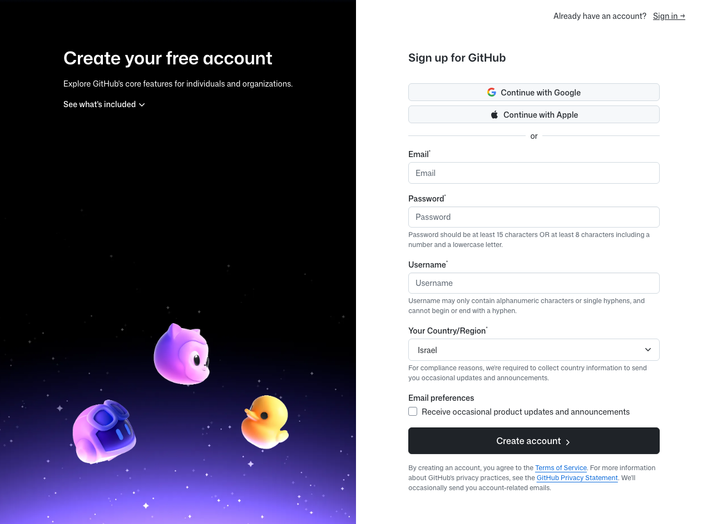
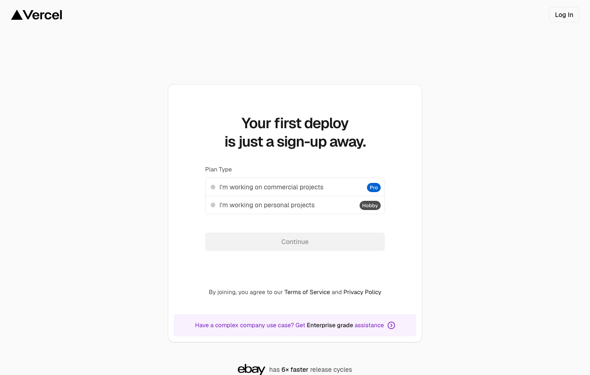
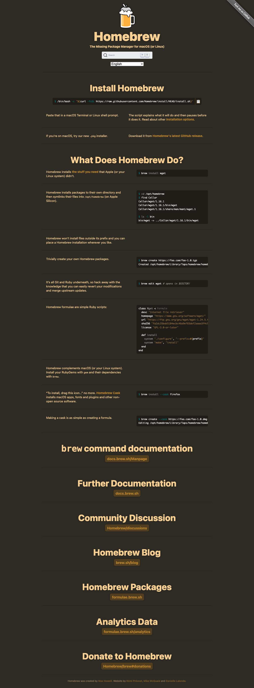
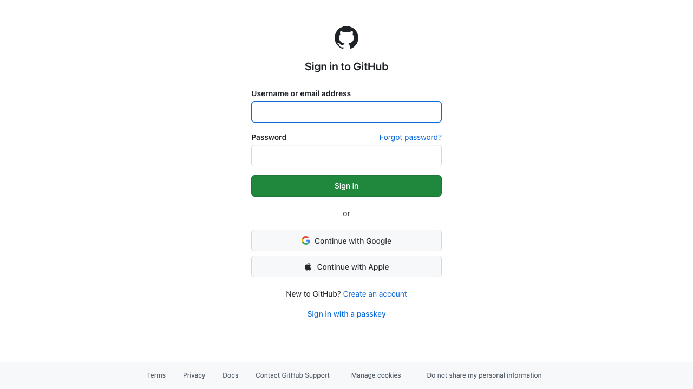
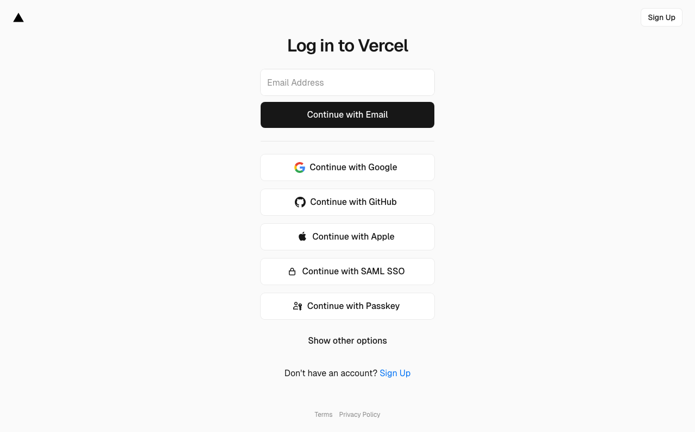
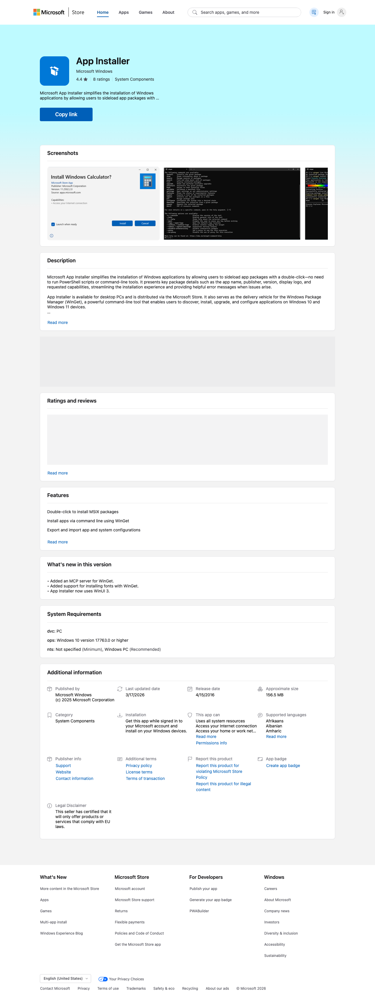
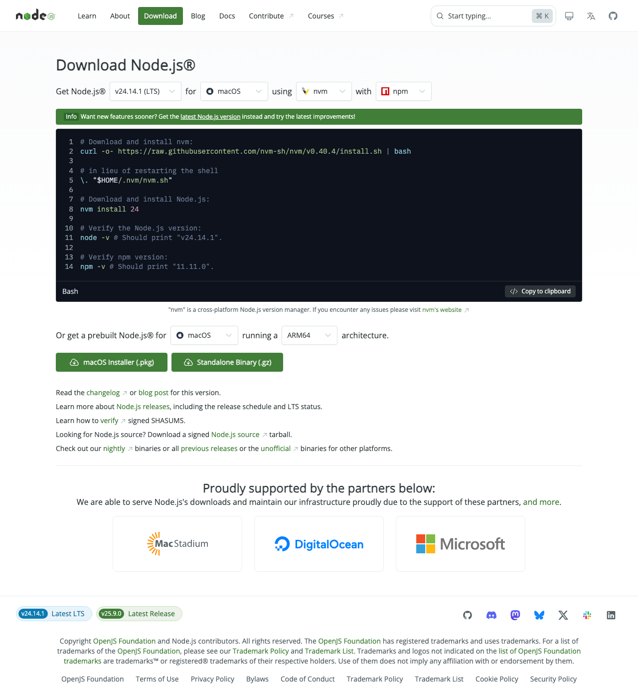

# Setting Up Claude Code: A Complete Beginner's Guide

*For Mac and Windows — no experience needed*

---

## What You're Setting Up

By the end of this guide you will have three tools installed and connected:

| Tool | What it does | Cost |
|------|-------------|------|
| **[GitHub](https://github.com/signup)** | Stores your code safely online — like Google Drive, but for code | Free |
| **[Vercel](https://vercel.com/signup)** | Publishes your websites and apps to the internet instantly | Free to start |
| **[Claude Code](https://claude.ai/download)** | AI coding assistant that runs on your desktop | $20/month |

These three tools work together. Claude Code writes the code, GitHub saves it, and Vercel puts it online.

**How long will this take?** About 30–45 minutes if everything goes smoothly.

---

## Step 1: Create Your Accounts

Do this section first, in a web browser. You do not need to touch the terminal yet.

---

### 1.1 Create a GitHub Account

1. Open your browser and go to **[github.com/signup](https://github.com/signup)**
3. Enter your email address, create a password, and choose a username
   > Your username will be visible to others. Keep it simple and professional, such as `jane-smith` or `jsmith-dev`. Avoid spaces.
4. Complete the puzzle or verification step GitHub shows you
5. Check your email and click the verification link GitHub sends you
6. When GitHub asks about a plan, choose **Free**
7. Answer or skip the setup questions — it does not matter either way



> **What you'll see after this step:** You land on a page that says "Welcome to GitHub" with a feed of activity. That means your account is ready.

---

### 1.2 Create a Vercel Account

Vercel is where your apps and websites will live once they are built.

1. Go to **[vercel.com/signup](https://vercel.com/signup)**
2. Select **Continue with GitHub**

> **What you'll see:** A GitHub screen will appear asking *"Authorize Vercel?"* — click the green **Authorize Vercel** button. You will be taken back to Vercel automatically.

4. When asked about a plan, choose **Hobby** — it is free
5. Answer or skip the setup questions



> **What you'll see after this step:** A Vercel dashboard with the heading "Let's build something new." Your account is ready.

---

### 1.3 Create a Claude Account and Subscribe to Pro

Claude Code requires a **Claude Pro** subscription at **$20 per month**. This is what powers the AI.

1. Go to **[claude.ai/signup](https://claude.ai/signup)**
3. Enter your email and create a password, or click **Continue with Google** if you prefer
4. Verify your email address by clicking the link Claude sends you
5. Once logged in, look for your name or a small icon in the **bottom left corner** of the screen
6. Click it, then click **Upgrade plan** or **Upgrade to Pro**
7. Choose the **Pro plan** at $20/month
8. Enter your payment details and confirm

> **What you'll see after subscribing:** The word **Pro** appears next to your name or avatar. That badge confirms your subscription is active.

> **Note on billing:** You can cancel anytime from the same account menu. You will not be charged again after cancelling.

---

## Part A: Mac Setup

> **New to Terminal?** Terminal is an app that lets you type instructions directly to your Mac. Think of it like texting — you type something, press Enter, and the Mac does it. You do not need to understand what the commands mean. Just copy them exactly as written and paste them in.

---

### A1: Open Terminal

1. Press **Command (⌘) + Space** at the same time — this opens Spotlight search
2. Type **Terminal**
3. Press **Enter**

A window opens with a plain background and a blinking cursor on a line that ends with `%` or `$`.

> **What you'll see:** Something like `yourname@MacBook ~ %` with a blinking cursor. This means Terminal is ready and waiting.

> **How to paste into Terminal:** Press **Command (⌘) + V**

> **If Terminal looks scary:** That is normal. You are not going to break anything by following these steps. If a command does not work, the worst that happens is an error message — nothing will be deleted or damaged.

---

### A2: Install Apple's Developer Tools

Apple hides some basic tools that developers need. This step installs them. You only ever do this once.

Copy the line below, paste it into Terminal, and press **Enter**:

```
xcode-select --install
```

> **What you'll see:** A popup window appears saying *"The xcode-select command requires the command line developer tools. Would you like to install the tools now?"*

Click **Install** — not "Get Xcode." Xcode is a 10 GB download you do not need.

A progress bar will appear. This takes **3 to 10 minutes** depending on your internet speed.

When it says *"The software was installed,"* click **Done** and come back to Terminal.

> **If you see "xcode-select: error: command line tools are already installed":** You are fine — skip to A3.

> **If the popup never appeared:** Try the command again. If it still does not appear, type `sudo xcode-select --reset` and press Enter. Enter your Mac password when asked, then run the original command again.

---

### A3: Install Homebrew

Homebrew is a tool that installs other tools for you. Think of it as a behind-the-scenes app store for developers. Most Mac developers install this on day one.



Copy and paste this entire command into Terminal (it is long but it is one command), then press **Enter**:

```
/bin/bash -c "$(curl -fsSL https://raw.githubusercontent.com/Homebrew/install/HEAD/install.sh)"
```

> **What you'll see:** Terminal will print a lot of text. At some point it will pause and say *"Press RETURN/ENTER to continue or any other key to abort."* Press **Enter**.

> **Password prompt:** It will ask for your Mac login password. Type it and press Enter. You will not see any characters appear as you type — that is intentional and normal. Just type your password and press Enter.

This takes **2 to 5 minutes**.

When it finishes, run this command to make Homebrew available every time you open Terminal:

```
if [ -n "$ZSH_VERSION" ]; then RC=~/.zprofile; else RC=~/.bash_profile; fi && echo 'eval "$(/opt/homebrew/bin/brew shellenv)"' >> "$RC" && eval "$(/opt/homebrew/bin/brew shellenv)"
```

> **What you'll see:** No output is the correct result — it means it worked silently.

> **If you see "Error: Permission denied":** Run this command, enter your password, then re-run the command above:
> ```
> sudo chown -R $(whoami) /opt/homebrew
> ```

---

### A4: Install Node.js and GitHub CLI

Node.js is the engine that powers many developer tools including Vercel CLI. GitHub CLI is what lets Terminal talk to GitHub.

```
brew install node gh
```

> **What you'll see:** A lot of text as Homebrew downloads and installs the tools. This can take 2–5 minutes. When the `%` cursor reappears on a new line by itself, it is done.

> **If you see "Error: brew: command not found":** Close Terminal completely and reopen it, then try again. If it still fails, re-run the last command from A3 and then try this step again.

---

### A5: Connect to GitHub

This links your Terminal to your GitHub account so they can communicate.

```
gh auth login
```

A menu appears. Use the **up/down arrow keys** to move between options and **Enter** to select.

**Step through the menu like this:**

1. *Where do you use GitHub?* → Select **GitHub.com** → press Enter
2. *What is your preferred protocol?* → Select **HTTPS** → press Enter
3. *Authenticate Git with your GitHub credentials?* → Select **Yes** → press Enter
4. *How would you like to authenticate GitHub CLI?* → Select **Login with a web browser** → press Enter

> **What you'll see:** A one-time code appears, something like `ABCD-1234`. The terminal also says to press Enter to open the browser.

5. **Copy the code**, then press **Enter**
6. Your browser opens to a GitHub sign-in page — log in if asked, then paste the code



7. Click **Authorize github**

Back in Terminal you will see: *"Logged in as yourname"* — success.

Now tell Git who you are. Replace the name and email with your own:

```
git config --global user.name "Your Name"
git config --global user.email "[email protected]"
```

> The name and email here do not need to match your GitHub account exactly, but it is good practice if they do.

---

### A6: Install and Connect Vercel CLI

Install Vercel's command-line tool:

```
npm install -g vercel
```

> **What you'll see:** A few lines of output ending with a version number. This takes under a minute.

Now connect it to your Vercel account:

```
vercel login
```

> **What you'll see:** A menu of login options. Select **Continue with GitHub** and press Enter. Your browser opens to a page like this — click **Continue with GitHub**:



You will see *"Congratulations! You are now logged in."*

---

### A7: Download and Install Claude Code Desktop

1. Open your browser and go to **[claude.ai/download](https://claude.ai/download)**
2. Download the **Mac** version
4. Open your **Downloads** folder and double-click the downloaded file (it will end in `.dmg`)

> **What you'll see:** A window with the Claude Code icon and an arrow pointing to an Applications folder icon.

5. **Drag** the Claude Code icon on top of the Applications folder icon
6. Wait a moment for it to copy

> **If you see "Claude Code cannot be opened because the developer cannot be verified":** This is a Mac security feature for new apps. Go to **System Settings → Privacy & Security**, scroll down, and click **Open Anyway** next to Claude Code.

7. Open **Finder → Applications** and double-click **Claude Code** to launch it
8. On first launch it will ask you to log in — use the claude.ai account from Step 1.3

> **What you'll see on first launch:** A welcome screen or login prompt. After logging in, you will see a chat interface. Claude Code may ask permission to access certain folders — click **Allow**.

---

### A8: Verify Your Mac Setup

Run this command to confirm all four tools are installed and working:

```
node -v && npm -v && gh --version && vercel --version
```

> **What you'll see — four lines like these:**
> ```
> v20.11.0
> 10.2.4
> gh version 2.45.0 (2024-01-15)
> Vercel CLI 33.5.2
> ```
> The exact version numbers do not need to match — just confirm you see four lines, not errors.

**If all four lines appear, your Mac setup is complete.** Jump to the [You Are Done](#you-are-done) section.

---

## Part B: Windows Setup

> **New to Windows Terminal?** Windows Terminal is an app that lets you type text instructions to your PC. It looks like a simple black or blue window. You type a command, press Enter, and Windows does it. You do not need to understand the commands — just copy them exactly and paste them in.

---

### B1: Check Your Windows Version

The tools in this guide require **Windows 10 version 1809 or newer**, or **Windows 11**.

To check your version:
1. Press the **Windows key + R** at the same time
2. Type `winver` and press **Enter**

> **What you'll see:** A window showing your Windows edition and version number, such as *"Version 22H2 (OS Build 19045...)"*

If your version number is **1809 or higher**, you are good.

If it is older, go to **Settings → Windows Update → Check for updates** and install everything, then restart your PC and come back.

---

### B2: Open Windows Terminal as Administrator

Running as Administrator gives Terminal the permissions needed to install software.

**On Windows 11:**
1. Right-click the **Start button** (bottom-left corner)
2. Click **Terminal (Admin)** or **Windows Terminal (Admin)**
3. Click **Yes** when asked if you want to allow changes

**On Windows 10:**
1. Press the **Windows key**
2. Type **PowerShell**
3. Right-click **Windows PowerShell** in the results
4. Click **Run as administrator**
5. Click **Yes** when asked

> **What you'll see:** A blue or dark window with text ending in `PS C:\Windows\system32>` or similar, with a blinking cursor. That `>` means it is ready for input.

> **How to paste in Windows Terminal:** Press **Ctrl + V**, or right-click anywhere inside the window

---

### B3: Install Node.js

Node.js powers the Vercel CLI and many other developer tools. We will install it using **winget** — a built-in Windows installer.

Paste this into Terminal and press **Enter**:

```
winget install OpenJS.NodeJS.LTS
```

> **What you'll see:** A progress bar fills across the screen. When it finishes you will see *"Successfully installed"*.

> **If you see "'winget' is not recognized":** See [Troubleshooting B3](#troubleshooting-b3-winget-not-found) below.

**Important:** Close Terminal completely and reopen it as Administrator (same steps as B2). Windows needs a fresh session to recognize the newly installed tool.

Confirm it worked:

```
node -v
```

You should see a version number like `v20.11.0`. If you see an error, see [Troubleshooting B3](#troubleshooting-b3-winget-not-found).

---

### B4: Install GitHub CLI

GitHub CLI is what lets Terminal communicate with your GitHub account.

```
winget install GitHub.cli
```

> **What you'll see:** Another progress bar, then *"Successfully installed."*

Close Terminal and reopen it as Administrator again.

---

### B5: Connect to GitHub

This links your Terminal to your GitHub account.

```
gh auth login
```

A menu appears. Use the **up/down arrow keys** and **Enter** to navigate:

1. *Where do you use GitHub?* → Select **GitHub.com** → press Enter
2. *What is your preferred protocol?* → Select **HTTPS** → press Enter
3. *Authenticate Git with your GitHub credentials?* → Select **Yes** → press Enter
4. *How would you like to authenticate?* → Select **Login with a web browser** → press Enter

> **What you'll see:** A one-time code like `ABCD-1234` appears on screen.

5. **Copy the code**, then press **Enter**
6. Your browser opens to a GitHub sign-in page — log in if asked, then paste the code


7. Click **Authorize github**

Back in Terminal: *"Logged in as yourname"* — done.

Now tell Git who you are. Replace the name and email with your own:

```
git config --global user.name "Your Name"
git config --global user.email "[email protected]"
```

---

### B6: Install Vercel CLI

```
npm install -g vercel
```

> **What you'll see:** Text scrolling by for a few seconds, then your `>` cursor returns on a new line. Done.

> **If you see "Access is denied" or "EACCES":** Make sure Terminal is running as Administrator (right-click → Run as administrator). Then try again.

---

### B7: Connect Vercel

```
vercel login
```

> **What you'll see:** A menu. Select **Continue with GitHub** using arrow keys, press Enter. Your browser opens to this page — click **Continue with GitHub**:


You will see *"Congratulations! You are now logged in."*

---

### B8: Download and Install Claude Code Desktop

1. Open your browser and go to **[claude.ai/download](https://claude.ai/download)**
2. Download the **Windows** version
4. Open your **Downloads** folder and double-click the installer file (it ends in `.exe`)

> **What you'll see:** Windows may show a blue warning screen saying *"Windows protected your PC."* This appears for new software that Windows has not seen before. It is safe to proceed.

5. Click **More info** on that blue screen
6. Click **Run anyway**
7. Follow the installer: click **Next**, **Next**, **Install**, then **Finish**

Claude Code will now appear in your **Start menu** and possibly on your desktop.

8. Open Claude Code from the Start menu
9. On first launch it will ask you to log in — use the claude.ai account from Step 1.3

> **What you'll see on first launch:** A welcome screen or login prompt. After logging in you will see a chat interface. If Windows asks whether to allow Claude Code through the firewall, click **Allow**.

---

### B9: Verify Your Windows Setup

```
node -v && npm -v && gh --version && vercel --version
```

> **What you'll see — four lines like these:**
> ```
> v20.11.0
> 10.2.4
> gh version 2.45.0 (2024-01-15)
> Vercel CLI 33.5.2
> ```

If you see four version numbers, your Windows setup is complete.

---

## You Are Done

Open Claude Code from your Applications folder (Mac) or Start menu (Windows). You should see a chat interface ready for your first message.

**Things to try first:**
- *"Create a simple webpage that says hello world"*
- *"Explain what this code does"* and paste in some code
- *"Help me start a new web project"*

Claude Code can run terminal commands on your behalf — you do not need to go back to Terminal unless something goes wrong.

---

## Troubleshooting

### Mac Troubleshooting

---

#### The popup for Command Line Tools never appeared (Step A2)

Try the command again:
```
xcode-select --install
```

If no popup appears, the tools may already be installed — run `xcode-select -p` and if you see a file path like `/Library/Developer/CommandLineTools`, you are fine, move on to A3.

If that path is missing, run:
```
sudo xcode-select --reset
```
Enter your password, then try the install command again.

---

#### `brew: command not found` after installing Homebrew (Step A3)

Close Terminal completely. Reopen it. Then run:
```
eval "$(/opt/homebrew/bin/brew shellenv)"
```

If that fixes it for this session but breaks again next time you open Terminal, also run:
```
echo 'eval "$(/opt/homebrew/bin/brew shellenv)"' >> ~/.zprofile
```

---

#### `brew install` says "Permission denied" (Step A4)

```
sudo chown -R $(whoami) /opt/homebrew
```
Enter your password, then try the brew install command again.

---

#### The browser did not open during GitHub login (Step A5)

Look at the Terminal output — there is usually a URL printed. Copy it and paste it manually into your browser. Complete the login there, then return to Terminal.

---

#### `npm install -g vercel` gives "permission denied" (Step A6)

```
sudo npm install -g vercel
```
Enter your Mac password when prompted.

---

#### Claude Code says "developer cannot be verified" (Step A7)

Go to **System Settings (or System Preferences) → Privacy & Security**. Scroll down until you see a message about Claude Code being blocked. Click **Open Anyway**. Enter your password if asked.

---

### Windows Troubleshooting

---

#### Troubleshooting B3: winget Not Found

`winget` comes pre-installed on Windows 10 version 1709+ and all of Windows 11, but it may be missing on older systems or fresh installs.

**Fix option 1 — Update through the Microsoft Store:**
1. Open the **Microsoft Store** (search for it in the Start menu)
2. Search for **App Installer**
3. Click **Update** or **Install** if it appears



**Fix option 2 — Update Windows:**
Go to **Settings → Windows Update → Check for updates**, install everything, restart your PC, and try again.

**Fix option 3 — Install Node.js manually:**
If winget still does not work after the above, go to **nodejs.org** in your browser, download the LTS version installer (it ends in `.msi`), run it, and follow the prompts. Make sure to leave the checkbox that says *"Add to PATH"* checked. Then reopen Terminal and continue from B4.



---

#### Node.js installed but `node -v` still says "not recognized" (Steps B3–B4)

This is a PATH issue — Windows knows Node.js is installed but does not know where to find it.

**Fix:** Close Terminal and reopen it as Administrator. Try `node -v` again. If it still fails, restart your PC and try again.

If it still does not work after a restart:
1. Search for **Environment Variables** in the Start menu
2. Click **Edit the system environment variables**
3. Click **Environment Variables** at the bottom
4. Under **System variables**, find **Path** and double-click it
5. Look for an entry containing `nodejs` — if it is missing, click **New** and add: `C:\Program Files\nodejs`
6. Click OK on all windows and reopen Terminal

---

#### `npm install -g vercel` gives "Access is denied" (Step B6)

Make sure Terminal is running as Administrator. Right-click on the Terminal or PowerShell icon and choose **Run as administrator**, then try the command again.

---

#### Windows shows "Windows protected your PC" for the Claude Code installer (Step B8)

This is a standard Windows SmartScreen warning for software it does not recognize yet. It is safe to proceed:
1. Click **More info** on the blue screen
2. Click **Run anyway**

---

#### "is not recognized as an internal or external command" after installing something

Close Terminal and reopen it as Administrator. Windows only recognizes newly installed tools after starting a fresh Terminal session.

---

#### Antivirus software is blocking the installation

Some antivirus programs block developer tools. If your antivirus shows a warning during any installation step:
- Look for an option like **Allow**, **Trust**, or **Add exception**
- If you are on a work or school computer, ask your IT department — they may have restrictions that prevent you from installing software

---

#### I am on a work or school computer and nothing works

Work and school computers often have policies that block software installation. You may see errors like *"You do not have permission"* or *"This operation requires elevation."* 

In this case, contact your IT department and ask them to install: **Node.js LTS**, **GitHub CLI**, and **Vercel CLI**. Show them this guide if helpful. You can still create all the accounts yourself and install Claude Code Desktop separately.

---

## Quick Reference: All Commands

**Mac — run these in order:**
```
xcode-select --install
/bin/bash -c "$(curl -fsSL https://raw.githubusercontent.com/Homebrew/install/HEAD/install.sh)"
if [ -n "$ZSH_VERSION" ]; then RC=~/.zprofile; else RC=~/.bash_profile; fi && echo 'eval "$(/opt/homebrew/bin/brew shellenv)"' >> "$RC" && eval "$(/opt/homebrew/bin/brew shellenv)"
brew install node gh
gh auth login
git config --global user.name "Your Name"
git config --global user.email "[email protected]"
npm install -g vercel
vercel login
```

**Windows — run these in order (Terminal as Administrator):**
```
winget install OpenJS.NodeJS.LTS
winget install GitHub.cli
gh auth login
git config --global user.name "Your Name"
git config --global user.email "[email protected]"
npm install -g vercel
vercel login
```

**Verify everything works (Mac and Windows):**
```
node -v && npm -v && gh --version && vercel --version
```

---

*Last updated: April 2026*
